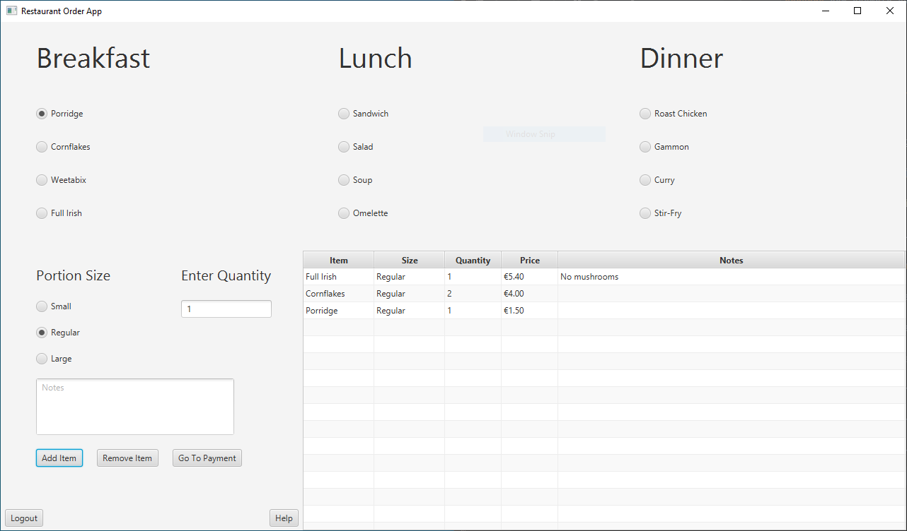
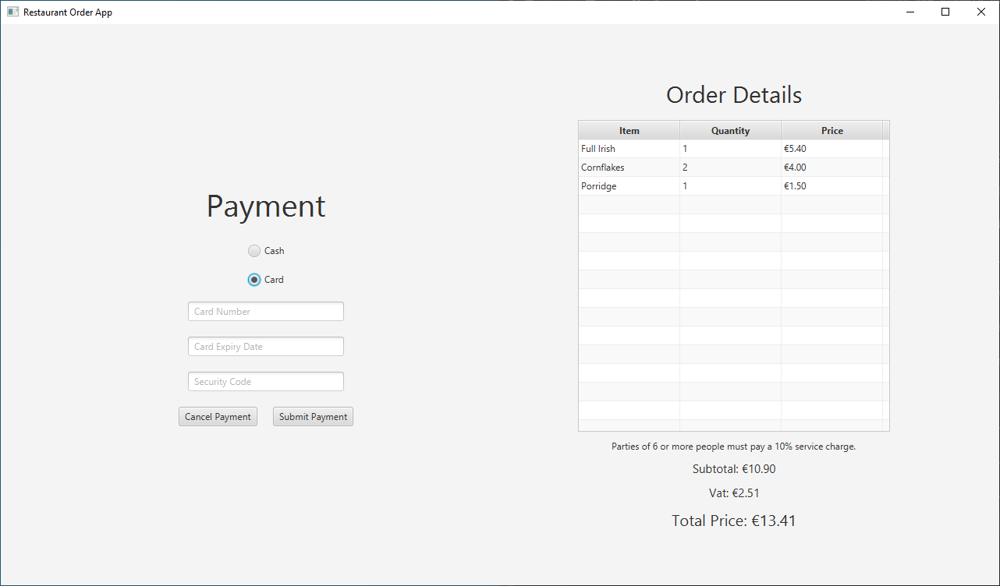
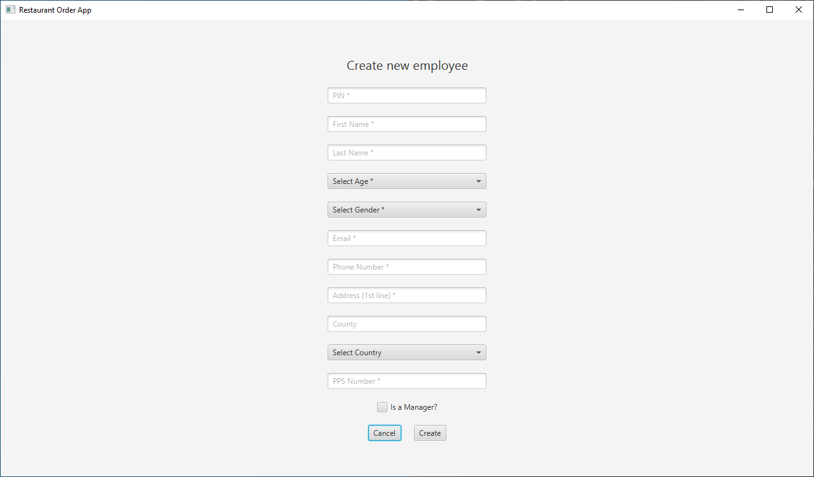

# JavaFX Restaurant Ordering Application

A JavaFX application where the user can take a customer's order from a menu and take payment for the items chosen.
A user can also add a new staff member to the system whose credentials can then be used to log in.

# Running the Project
This project is made using JavaFX. My recommendation for how to run this would be to use Intellij and create a new project from version control, providing this URL.
This is by far the easiest way and requires no manual configuration on your side.

Once in the app, There are two example users provided with pins of `1234` and `5678` for a manager and regular user respectively. 
Managers have access to a screen showing the days takings.

For more detailed information on JavaFX, refer to the documentation [here](https://openjfx.io/openjfx-docs/).

# Screenshots

Below are some screenshots from the program.

## The Menu Screen

## The Payment Screen

## Create a New Staff Member Screen

